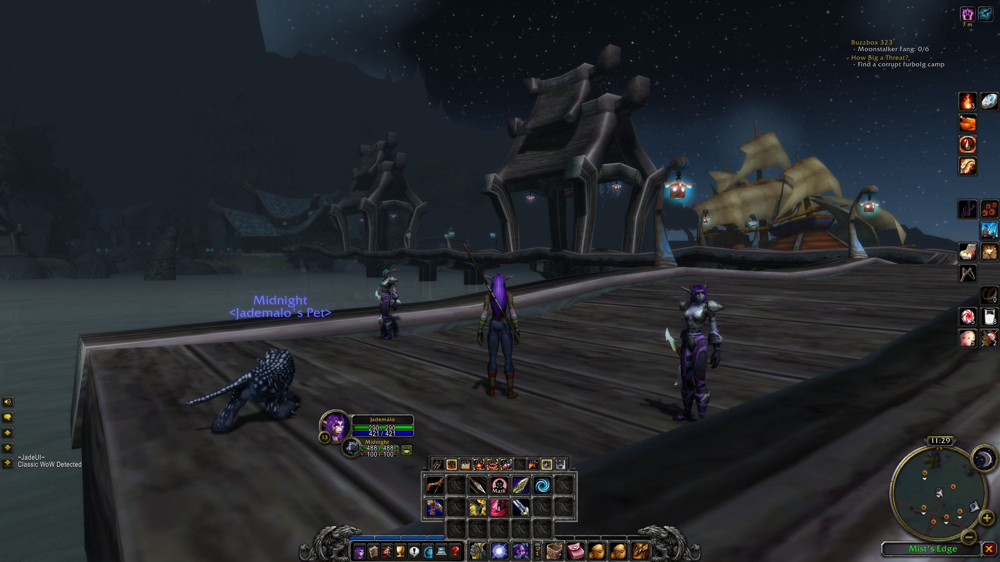

# JadeUI Classic
This is a UI modification designed around the key layout of the Logitech G13, with the goal of keeping as close to the feel and look of the vanilla UI as possible while implementing a few changes to suit more modern sensibilities.

There are a variety of options, such as selecting the end cap artwork and moving things such as the Unitframes or the Map into more preferable places.

Where possible I've tried to use original Blizzard frames, keeping them as intact as possible. Most of the alterations are simply based around moving frames rather than totally replacing them.  

The visual bar art has all been created by modifying the original assets. Details down to the levelup pips have been preserved and kept correct. The Keyring is automatically enabled regardless of level to keep the visual design consistent, and there's an option to enable the talent button at all times.

The XP and Rep bars will go to the foreground on hover, but remain behind the buttons and art frame at all other times.

There is also an option to enable a screenshot on level up, since it's a nice little feature.

